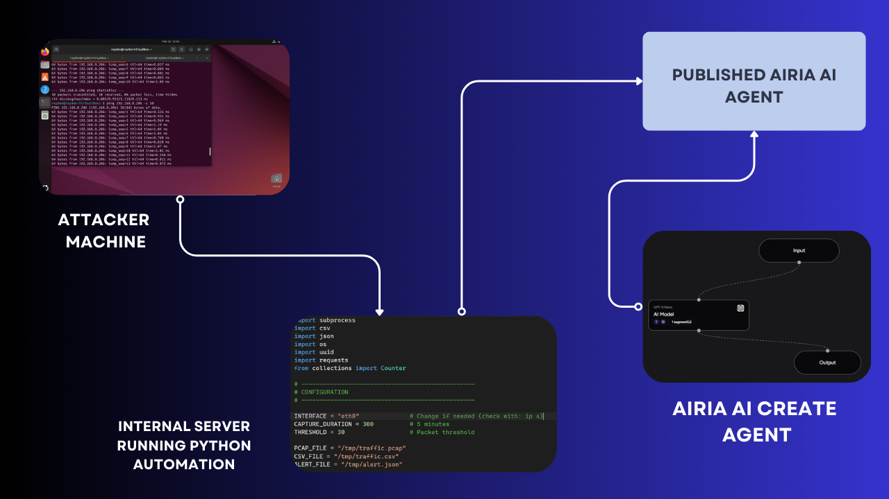

# 🛡️ AI-Powered SOC Triage & Threat Analysis Platform

An AI-assisted Security Operations Center (SOC) automation platform that captures network telemetry, generates structured alerts, and performs automated threat triage using Airia AI Agents and SOC playbooks.

---

## Architecture



---

## 🎥 Demo Video

Watch the full project demonstration on LinkedIn.

▶ [View Demo on LinkedIn](https://www.linkedin.com/posts/yunusemreakcicek_cybersecurity-soc-blueteam-ugcPost-7464622033012842496-O7W2/?utm_source=share&utm_medium=member_desktop&rcm=ACoAAE2cyYcBX6Fm-PhVdoQ94EZP5CYmDkbnJmI)

## Project Overview

This project automates the early stages of SOC operations.

Workflow:

Attacker Simulation  
↓  
Traffic Capture (tshark)  
↓  
Packet Analysis  
↓  
Alert Generation (JSON)  
↓  
Airia AI Agent Processing  
↓  
Threat Classification  
↓  
SOC Analyst Decision Support

---

## Features

- Automated network traffic monitoring
- Packet analysis and anomaly detection
- Structured alert generation
- AI-powered SOC triage
- Risk scoring
- MITRE ATT&CK mapping
- Automated analyst recommendations
- Playbook-driven decision workflow

---

## Repository Structure

```text
architecture/
src/
playbooks/
examples/
```

---

## Technologies

- Python
- tshark
- JSON
- Airia AI Agent
- Network Analysis
- SOC Playbooks
- MITRE ATT&CK

---

## Quick Start

### Install

```bash
pip install requests
```

### Run

```bash
python src/soc_automation.py
```

---

## Demo Scenario

Example:

1. Suspicious traffic detected
2. Alert generated
3. Alert forwarded to Airia Agent
4. AI performs triage
5. SOC recommendations returned

---

## Disclaimer

This project is intended for defensive cybersecurity research, SOC workflow automation, and security education.

---

## Author

Yunus Emre AKÇİÇEK
